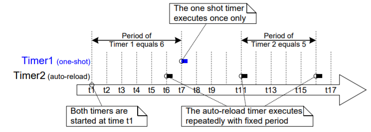
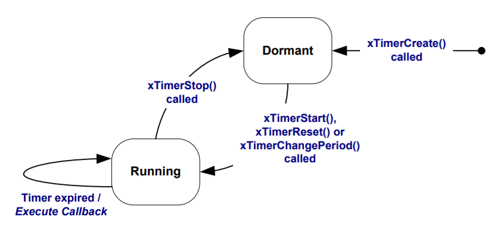
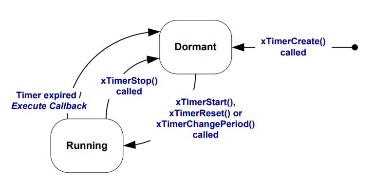
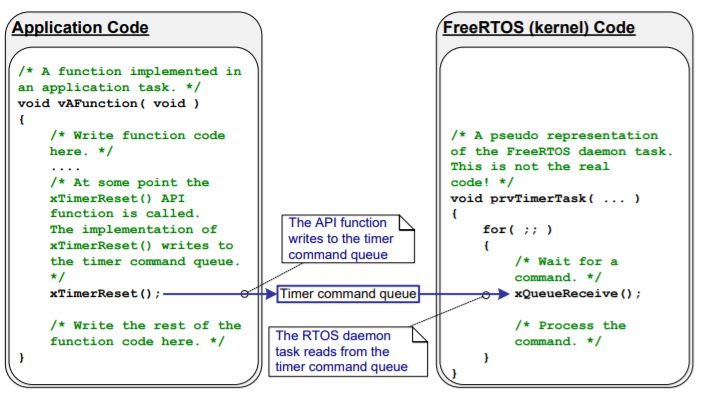
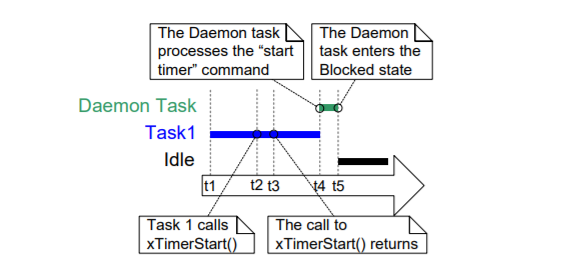

# 软件定时器

## 章节介绍和范围

软件计时器用于调度功能在将来的设定时间执行，或以固定频率定期执行。由软件定时器执行的函数称为软件定时器的回调函数。

软件计时器由FreeRTOS内核实现，并受FreeRTOS内核的控制。它们不需要硬件支持，也与硬件计时器或硬件计数器无关。

请注意，根据FreeRTOS使用创新设计以确保最高效率的理念，软件计时器不会使用任何处理时间，除非软件计时器回调函数实际正在执行。

软件计时器功能是可选的。要包括软件计时器功能，请执行以下操作: 

1.  将FreeRTOS源文件FreeRTOS/Source/timers.c构建为项目的一部分 
2.  在FreeRTOSConfig.h中将configUSE\_TIMERS设置为1。

**范围** 本章旨在让读者更好地了解以下内容：

* 软件定时器的特性与任务特性的比较。
* RTOS后台任务。
* 计时器命令队列。
* 单次软件定时器和周期性软件定时器之间的区别。
* 如何创建、启动、重置和更改软件计时器的周期。

## 软件定时器回调函数

软件计时器回调函数被实现为C函数。它们唯一的特别之处是它们的原型，它必须返回void，并将软件计时器的句柄作为其唯一的参数。清单72演示了回调函数原型。

```c
void ATimerCallback( TimerHandle_t xTimer );
```

清单72.软件计时器回调函数原型

软件计时器回调函数自始至终执行，并以正常方式退出。它们应该保持简短，并且不能进入阻塞状态。

_注意：正如将看到的，软件计时器回调函数在启动FreeRTOS调度程序时自动创建的任务的上下文中执行。 因此，软件计时器回调函数决不能调用会导致调用任务进入阻塞状态的FreeRTOS API函数，这一点至关重要。 可以调用xQueueReceive\(\)之类的函数，但前提是该函数的xTicksToWait参数\(指定函数的阻塞时间\)设置为0。 调用vTaskDelay\(\)之类的函数是不对的，因为调用vTaskDelay\(\)会始终将调用任务置于阻塞状态。_

## 软件计时器的属性和状态

**软件计时器的周期** 软件计时器的‘周期’是软件计时器启动和软件计时器的回调函数执行之间的时间

**单次计时器和自动重新加载计时器** 有两种类型的软件计时器： 

1. 单次计时器 一旦启动，一次性定时器将只执行其回调函数一次。一次性计时器可以手动重新启动，但不会自行重新启动。
2. 自动重新加载计时器 一旦启动，自动重新加载计时器将在每次到期时重新启动，从而定期执行其回调函数。

图38显示了单次定时器和自动重新加载定时器之间的行为差异。虚线垂直线标记计时中断发生的时间。



参考图38：

* 计时器1 定时器1是具有6个滴答周期的一次性定时器。它在时间t1启动，因此它的回调函数在6个刻度之后，即时间t7执行。由于定时器1是一次性定时器，其回调函数不会再次执行。
* 计时器2 定时器2是具有5个滴答周期的自动重新加载定时器。它在时间t1启动，因此它的回调函数在时间t1之后每5个节拍执行一次。在图38中，这是时间t6、t11和t16。

**软件计时器状态** 软件计时器可以处于以下两种状态之一：

* 休眠

  存在休眠的软件计时器，可以由其句柄引用，但不在运行，因此其回调函数将不会执行。

* 运行 正在运行的软件定时器，将在自该软件定时器进入运行状态，或自该软件定时器上次被重置以来经过与其周期相等的时间之后执行其回调功能。

  图39和图40分别显示了自动重新加载定时器和单次定时器在休眠和运行状态之间可能的转换。这两个图的关键区别在于定时器到期后进入的状态；自动重新加载定时器执行其回调函数，然后重新进入运行状态，一次性定时器执行其回调函数，然后进入休眠状态。

xTimerDelete\(\)接口函数的作用是：删除计时器。可以随时删除计时器。





##  软件定时器的上下文

**RTOS守护\(计时器服务\)任务** 

所有软件计时器回调函数都在同一RTOS守护进程\(或“计时器服务”\)任务的上下文中执行\[1\]。 

* _\[1\]. 该任务过去被称为“计时器服务任务”，因为最初它只用于执行软件计时器回调函数。现在同一任务也用于其他目的，因此它被称为“RTOS守护程序任务”的更一般的名称。_

守护程序任务，是在启动调度程序时，自动创建的标准FreeRTOS任务。其优先级和堆栈大小分别由configTIMER\_TASK\_PRIORITY和configTIMER\_TASK\_STACK\_DEPTH编译时间配置常量设置。这两个常量都在FreeRTOSConfig.h中定义。

软件计时器回调函数不得调用会导致调用任务进入阻塞状态的FreeRTOS API函数，否则将导致守护程序任务进入阻塞状态。

**计时器命令队列** 

软件计时器API函数将命令从调用任务发送到称为“计时器命令队列”的队列上的守护程序任务。这如图41所示。命令的例子包括“启动定时器”、“停止定时器”和“重置定时器”。

计时器命令队列是在启动调度程序时自动创建的标准FreeRTOS队列。定时器命令队列的长度由FreeRTOSConfig.h中的configTIMER\_QUEUE\_LENGTH编译时间配置常量设置。



**守护进程任务调度** 

守护程序任务与任何其他FreeRTOS任务一样进行调度；当守护程序任务是能够运行的最高优先级任务时，它只会处理命令或执行计时器回调函数。图42和图43演示了configTIMER\_TASK\_PRIORITY设置如何影响执行模式

图42显示了当守护程序任务的优先级低于调用xTimerStart\(\)API函数的任务的优先级时的执行模式




